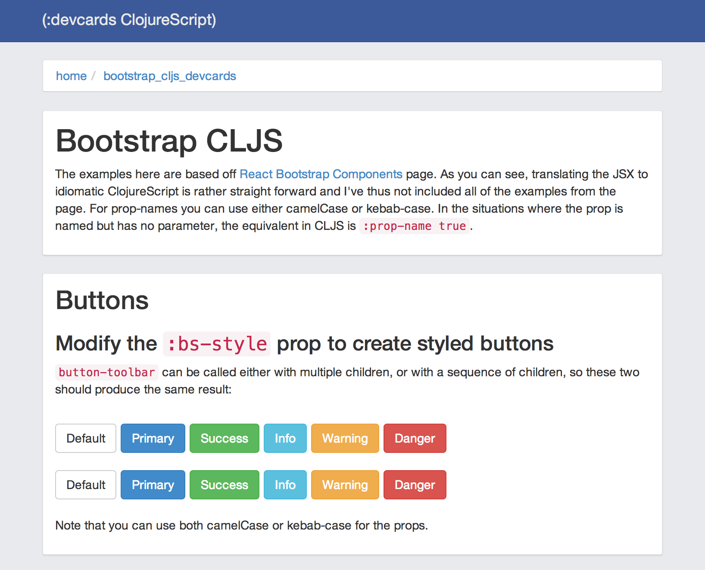

# Bootstrap-CLJS
----------------

Bootstrap CLJS is a wrapper around [React Bootstrap](http://github.com/react-bootstrap), inspired by, and in fact largely implemented using [om-tools](https://github.com/Prismatic/om-tools). This means that you can use React Bootstrap components using the same syntax as you'd use with `om-tools.dom`, giving you the following benefits, as directly quoted from their README file:

> `om-tools.dom` mirrors the `om.dom` namespace while using macros and minimal runtime overhead to make the following improvements:
> 
> * Element attributes are not required to be JavaScript values and are optional. You don't need to use the `#js` reader macro or `nil` for no attributes.
> * More natural attribute names. We translate attributes like `:class` to `:className` and `:on-click` to `:onClick` to stay consistent with Clojure naming conventions.
> * Children can be in collections. You don't need to use `apply` if you have a sequence of children or use `concat` for combining sequences of siblings.

Example by comparison:

```clojure
(ns example
  (:require [om.dom :as dom :include-macros true]))

(apply dom/div #js {}
  (map #(js/ReactBootstrap.Button #js {:bsStyle %} (str/capitalize %))
       ["default" "primary" "success" "info" "warning" "danger"]))
```
vs.

```clojure
(ns example
  (:require [om-tools.dom :as dom :include-macros true]
            [bootstrap-cljs :as bs :include-macros true]))

(dom/div
  (map #(bs/button {:bs-style %} (str/capitalize %))
       ["default" "primary" "success" "info" "warning" "danger"]))
```

## Usage

The project comes with examples translated from [React Bootstrap Components](http://react-bootstrap.github.io/components.html) page via a very cool project called [Devcards](https://github.com/bhauman/devcards). To see the examples in action do `lein deps` -> `lein cljx once` -> `lein figwheel` and navigate your browser to http://localhost:3449/index.html#!/bootstrap_cljs_devcards . If everything went as planned you should see a page that looks something like this:



Open the file `/devcards_src/bootstrap_cljs_devcards.cljs` in your favorite editor and start playing around. Everytime you save the file the changes get compiled and served via [figwheel](http://github.com/bhauman/figwheel), and your browser window should get automatically refreshed so you can see your changes practically in real time.

There is also a [Weasel](https://github.com/tomjakubowski/weasel) browser REPL included with the projects Devcards page. To use it call `(start-repl)` in the `user` namespace and then load up the Devcards page of the project.

## License

Distributed under the Eclipse Public License either version 1.0 or (at
your option) any later version. 
